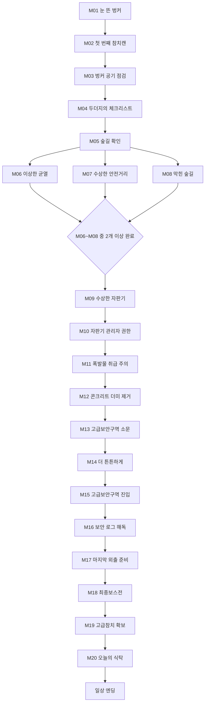
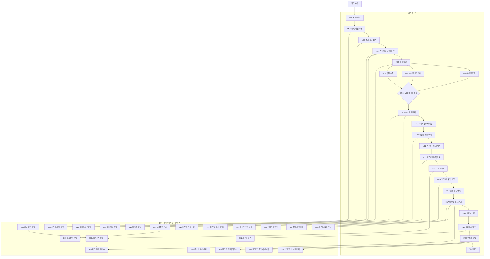

# Tuna Sweeper SSOT - 맵 진행 / 퀘스트 / 아이템 v0.6

> [!NOTE] 로컬 스토리 검토본
> - 세트: 정규 버전
> - 원본 저장소 기준 커밋: `1ded0ce978b749bb19708c6e8cbf5df8e91e534d`
> - 현재 UE5 구현 퀘스트/런타임 데이터는 반영하지 않음.
> - 기존 안내 캐릭터 `캔봇`은 현재 설정의 `두더지`로 치환함.
> - 원문 출처: `Docs/SSOT/TunaSweeper_SSOT_Quest_Item_v0.6.md`

> 작성 기준: 현재 대화에서 확정된 내용 기준.  
> 목적: 이후 새 채팅/외부 SSOT에서 우선 참조할 수 있는 단일 기준 문서.

---

## 1. 핵심 확정 사항

### 1.1 게임 진행 기본

- 게임은 **단일 맵 기반 익스트랙션 슈터**다.
- 본편에서는 후속 지역 떡밥을 뿌리지 않는다.
- DLC 가능성은 외적으로 열어둘 수 있지만, 본편 엔딩은 자체 완결을 목표로 한다.
- 엔딩은 다음 지역 이동이 아니라 **루나와 두더지의 일상 안정화 엔딩**이다.
- 최종보스는 본편 기준의 **최종보스**다.
- 보스를 잡아도 즉시 엔딩으로 직행하지 않는다.
- 보스 처치 이후에도 메인 퀘스트 마지막 단계와 엔딩 조건을 통해 엔딩에 도달한다.

### 1.2 시설 복구 / 하우징

- 기존의 강제형 `시설복구1`, `시설복구2` 구조는 사용하지 않는다.
- 시설 복구 개념은 **퀘스트 보상형 하우징 해금**으로 대체한다.
- 하우징 해금은 약 3종 예정이다.
- 하우징은 강제가 아니다.
- 열지 않아도 클리어 가능하지만, 열지 않으면 플레이가 불편하거나 플레이 타임이 늘어난다.

### 1.3 포탈 처리

- 포탈은 메인 퀘스트에서 직접 안내하지 않는다.
- 포탈 사용법, 위치, 목적지를 퀘스트 텍스트에서 언급하지 않는다.
- 플레이어가 직접 발견하는 불친절한 편의 요소로 둔다.
- 퀘스트에서는 “어딘가를 부술 수 있다”, “막힌 길을 열 수 있다” 정도만 암시한다.
- 콘크리트 더미를 파괴하면 실제로는 숲길과 포탈 방향 동선이 개선되지만, 퀘스트 설명에는 포탈을 언급하지 않는다.

### 1.4 워프/포탈/콘크리트 더미

- 워프포인트/포탈은 처음부터 사용 가능하다.
- 초기에는 사실상 단방향적이다.
- 복귀 포탈로 오면 낙하뿐인 동선이다.
- 숲길로 가는 길목이 콘크리트 더미로 막혀 있다.
- 자판기 폭발물을 이용해 콘크리트 더미를 영구 파괴할 수 있다.
- 파괴 후 숲길에서 포탈 방향으로 이동 가능해진다.
- 이 기능은 편의성 해금이며, 직접적인 포탈 안내 없이 플레이어가 발견하게 한다.

### 1.5 자판기 폭발물

- 자판기 폭발물은 처음부터 판매하지 않는다.
- 폭발물은 **퀘스트로 해금되는 자판기 상품**이다.
- 자판기 UI에는 상품별 해금 조건 시스템이 필요하다.
- 폭발물은 콘크리트 더미 영구 파괴에 사용한다.

### 1.6 보급창고

- 보급창고는 필수 구역이 아니다.
- 보급창고는 확률적 필드 파밍으로 단서를 얻어 해금한다.
- 약 2시간 정도 플레이하면 충분히 나올 정도의 확률을 목표로 한다.
- 보급창고를 열면 파밍 체감 확률이 증가한다.
- 보급창고를 열지 않아도 메인 진행은 가능하지만 플레이 시간이 늘어난다.

### 1.7 가방 공간 확장

- 정확한 명칭은 **가방 공간 확장**이다.
- 이름은 가방 공간 확장이지만, 실제로는 몸에 붙는 상수 증가 효과다.
- 별도 가방 장착이 아니라 캐릭터의 기본 수납량이 영구 증가한다.
- 재료만 있으면 언제든 가능하다.
- 핵심 재료는 **철지난 NFT**다.

#### 철지난 NFT 확정 설명

> 한때는 미래라고 불렸지만, 지금은 가방 공간을 늘리는 데나 쓰인다.

### 1.8 화장실 수리 드립

- 화장실 수리는 실제 기능이나 퀘스트가 아니다.
- 수리할 수 없고, 수행해야 하는 목표도 아니다.
- 단지 “불편하니까 언젠가는 고쳐야 한다”는 개그 대화 요소로 사용한다.
- 추천 삽입 위치:
  - M03. 벙커 공기 점검: 첫 언급
  - M04. 두더지의 체크리스트: 체크리스트 개그
  - S20. 엔딩 후: 벙커 대청소: 반복 개그 회수

### 1.9 고급보안구역

- 기존 `검문초소` 명칭은 폐기한다.
- 공식 명칭은 **고급보안구역**이다.
- 상위 레벨 적이 등장하는 위험 구역이다.
- 방어구 강화와 장비 성장 필요성을 체감시키는 후반 구역이다.

### 1.10 엔딩 조건

현재 엔딩 최종 조건:

1. **고급참치** 확보
2. **메인 퀘스트 마지막 단계 도달**

- 고급참치 획득처는 아직 미정이다.
- 고급참치는 보급창고 전용 보상으로 두면 안 된다. 보급창고가 선택형이기 때문이다.
- 보스 처치와 고급참치 획득의 관계는 미정이다.

---

## 2. 퀘스트 선행조건 규칙

### 2.1 메인 퀘스트

- 메인 퀘스트는 엔딩까지 이어지는 필수 진행 체인이다.
- 단, 모든 메인퀘스트를 1→2→3 순서로 완전 직렬화하지 않는다.
- 큰 챕터는 직렬로 진행하되, 챕터 내부의 일부 소목표는 병렬로 열어 진행 피로를 줄인다.
- 메인 퀘스트는 대략 20개로 구성한다.

### 2.2 선택 퀘스트

- 선택/편의/하우징/생활 퀘스트는 특정 메인 퀘스트 완료 후 해금된다.
- 선택 퀘스트는 메인 진행을 직접 막지 않는다.
- 선택 퀘스트 보상은 편의성, 파밍 효율, 하우징, 대사, 성장 보너스 중심이다.

### 2.3 가방 공간 확장

- 재료만 있으면 언제든 가능하다.
- 단, UI/기능 안내는 초반 메인 퀘스트 이후 노출하는 것이 적절하다.

### 2.4 보급창고

- 선택형이다.
- 필드 파밍으로 단서를 얻은 뒤 해금된다.
- 메인 진행 필수 조건으로 쓰지 않는다.

### 2.5 엔딩 후 퀘스트

- M20 완료 이후 열린다.
- 후일담, 생활 잔업, 반복 플레이용 가벼운 목표로 둔다.

---

## 3. 메인 퀘스트 진행 Mermaid 그래프



---

## 4. 전체 퀘스트 해금 Mermaid 그래프



---

## 5. 메인 퀘스트 20개

| ID | 퀘스트명 | 카테고리 | 선행조건 | 요구 아이템 | 보상/해금 |
|---|---|---|---|---|---|
| M01 | 눈 뜬 벙커 | 메인 / 튜토리얼 | 없음 | 없음 | 기본 조작, 벙커 상호작용 |
| M02 | 첫 번째 참치캔 | 메인 / 첫 파밍 | M01 | 찌그러진 참치캔 x1 | 보관함 안내, 파밍 루프 |
| M03 | 벙커 공기 점검 | 메인 / 거점 상태 확인 | M02 | 먼지 낀 필터 x2, 낡은 테이프 x1 | 중앙 파밍 구간 유도 |
| M04 | 두더지의 체크리스트 | 메인 / 캐릭터 소개 | M03 | 클립보드 x1, 볼펜 x1, 반쯤 남은 건전지 x2 | 퀘스트 목록 안내, 숲길 탐색 유도 |
| M05 | 숲길 확인 | 메인 / 초반 탐색 | M04 | 길가의 표식 리본 x3, 젖은 지도 조각 x1 | 숲길 구역 진행 |
| M06 | 이상한 균열 | 메인 / 막힌 길 암시 | M05 | 콘크리트 가루 x2, 금 간 표지판 x1 | 부술 수 있는 지형 암시 |
| M07 | 수상한 안전거리 | 메인 / 폭발물 암시 | M05 | 경고 표지 조각 x2, 녹슨 말뚝 x2, 찢어진 안전선 x1 | 폭발물 사용 지형 암시 |
| M08 | 막힌 숲길 | 메인 / 숏컷 사전 발견 | M05 | 콘크리트 파편 x3, 녹슨 철근 조각 x2 | 콘크리트 더미 파괴 목표 암시 |
| M09 | 수상한 자판기 | 메인 / 자판기 시스템 | M06~M08 중 2개 이상 | 구겨진 포인트 카드 x1, 오래된 동전 x3 | 자판기 시스템 해금 |
| M10 | 자판기 관리자 권한 | 메인 / 자판기 해금 조건 | M09 | 관리자 태그 x1, 끈적한 영수증 x2, 자판기 점검표 x1 | 상품 해금 조건 UI 개방 |
| M11 | 폭발물 취급 주의 | 메인 / 폭발물 해금 | M10 | 화약 냄새 나는 부품 x2, 경고 스티커 x3, 낡은 안전 매뉴얼 x1 | 자판기 폭발물 해금 |
| M12 | 콘크리트 더미 제거 | 메인 / 영구 지형 변화 | M11 | 자판기 폭발물 x1 | 콘크리트 더미 영구 파괴, 막힌 길 개방 |
| M13 | 고급보안구역 소문 | 메인 / 후반 구역 유도 | M12 | 보안구역 출입증 조각 x2, 망가진 무전기 x1 | 고급보안구역 위치 힌트 |
| M14 | 더 튼튼하게 | 메인 / 장비 성장 유도 | M13 | 찢어진 방탄섬유 x3, 볼트 묶음 x2, 깨진 헬멧 조각 x1 | 방어구 강화 안내 |
| M15 | 고급보안구역 진입 | 메인 / 후반 위험 구역 | M14 | 고급보안구역 기록칩 x1, 파손된 경비 드론 렌즈 x1 | 최종보스 관련 단서 |
| M16 | 보안 로그 해독 | 메인 / 최종보스 단서 | M15 | 손상된 데이터카드 x2, 싸구려 USB x1, 키보드 키캡 x3 | 최종보스 위치 힌트 |
| M17 | 마지막 외출 준비 | 메인 / 보스전 준비 | M16 | 비상식량 팩 x2, 휴대용 정수필터 x1, 행운의 캔따개 x1 | 최종보스전 진행 가능 |
| M18 | 최종보스전 | 메인 / 최종 전투 | M17 | 없음 또는 보스구역 진입 신호기 x1 | 보스 처치 기록, 엔딩 직전 퀘스트 |
| M19 | 고급참치 확보 | 메인 / 엔딩 조건 | M18 | 고급참치 x1, 은박 보냉팩 x1, 작은 접시 x1 | 엔딩 조건 일부 충족 |
| M20 | 오늘의 식탁 | 메인 / 엔딩 | M19 | 고급참치 x1, 깨끗한 포크 x1, 멀쩡한 식탁보 x1, 작은 꽃병 x1 | 일상 엔딩 |

---

## 6. 메인 퀘스트 상세

### M01. 눈 뜬 벙커

- **카테고리:** 메인 / 튜토리얼
- **내용:** 루나가 동면 장치에서 깨어난다. 두더지가 현재 벙커 상태와 외부 탐색 필요성을 알려준다.
- **요구 아이템:** 없음
- **보상:** 기본 조작, 벙커 상호작용, 첫 외부 탐색 개방

### M02. 첫 번째 참치캔

- **카테고리:** 메인 / 첫 파밍
- **내용:** 루나의 에너지 확보를 위해 외부에서 식량을 회수한다.
- **요구 아이템:** 찌그러진 참치캔 x1
- **보상:** 보관함 사용 안내, 기본 파밍 루프 학습

### M03. 벙커 공기 점검

- **카테고리:** 메인 / 거점 상태 확인
- **내용:** 벙커 공기 상태를 확인한다. 실제 시설 복구가 아니라 벙커가 엉망이라는 걸 보여준다.
- **요구 아이템:** 먼지 낀 필터 x2, 낡은 테이프 x1
- **보상:** 중앙 파밍 구간 유도
- **대화 삽입:** 화장실 수리 드립 첫 언급 추천.

예시 대사:

```text
두더지: 환기 필터 상태가 좋지 않아. 벙커 공기 질이 기준치 아래야.
루나: 그럼 먼저 고쳐야 해?
두더지: 우선 필터부터 확인하면 돼. 그리고… 화장실도 언젠가는 고쳐야 해.
루나: 화장실?
두더지: 불편하니까.
루나: 나 안드로이드인데?
두더지: 섭취 기능이 있으면 배출 문제도 따라와.
루나: 그건 너무 현실적인데…
두더지: 현실은 대체로 불편해.
```

### M04. 두더지의 체크리스트

- **카테고리:** 메인 / 두더지 성격 소개
- **내용:** 두더지가 쓸데없이 꼼꼼한 생존 체크리스트를 작성하려 한다.
- **요구 아이템:** 클립보드 x1, 볼펜 x1, 반쯤 남은 건전지 x2
- **보상:** 퀘스트 목록 시스템 안내, 숲길 탐색 유도
- **대화 삽입:** 체크리스트 항목에 화장실 수리가 있지만 지금은 하지 않는 개그 가능.

### M05. 숲길 확인

- **카테고리:** 메인 / 초반 탐색
- **내용:** 서쪽 숲길을 확인하고 길 상태를 기록한다.
- **요구 아이템:** 길가의 표식 리본 x3, 젖은 지도 조각 x1
- **보상:** 숲길 구역 진행

### M06. 이상한 균열

- **카테고리:** 메인 / 막힌 길 암시
- **내용:** 숲길 주변에서 부술 수 있을 것 같은 균열과 잔해를 발견한다. 포탈은 언급하지 않는다.
- **요구 아이템:** 콘크리트 가루 x2, 금 간 표지판 x1
- **보상:** “어딘가를 부술 수 있다”는 힌트

### M07. 수상한 안전거리

- **카테고리:** 메인 / 폭발물 암시
- **내용:** 누군가 폭발물을 사용하려 했던 흔적을 조사한다. 어디에 쓰는지는 직접 알려주지 않는다.
- **요구 아이템:** 경고 표지 조각 x2, 녹슨 말뚝 x2, 찢어진 안전선 x1
- **보상:** 폭발물 사용 가능 지형 암시

### M08. 막힌 숲길

- **카테고리:** 메인 / 숏컷 사전 발견
- **내용:** 숲길 길목을 막는 콘크리트 더미를 확인한다. 이 길이 어디로 통하는지는 명확히 설명하지 않는다.
- **요구 아이템:** 콘크리트 파편 x3, 녹슨 철근 조각 x2
- **보상:** 콘크리트 더미 파괴 목표 암시

### M09. 수상한 자판기

- **카테고리:** 메인 / 자판기 시스템
- **선행조건:** M06~M08 중 2개 이상 완료
- **내용:** 자판기를 조사한다. 구매 가능한 상품과 잠긴 상품이 있음을 확인한다.
- **요구 아이템:** 구겨진 포인트 카드 x1, 오래된 동전 x3
- **보상:** 자판기 시스템 해금, 상품 잠금 상태 표시 확인

### M10. 자판기 관리자 권한

- **카테고리:** 메인 / 자판기 해금 조건
- **내용:** 자판기의 잠긴 상품 정보를 확인하기 위해 관리자 권한을 얻는다.
- **요구 아이템:** 관리자 태그 x1, 끈적한 영수증 x2, 자판기 점검표 x1
- **보상:** 자판기 상품 해금 조건 UI 개방, 폭발물 상품 잠김 조건 표시

### M11. 폭발물 취급 주의

- **카테고리:** 메인 / 폭발물 해금
- **내용:** 자판기에서 폭발물 상품을 해금한다.
- **요구 아이템:** 화약 냄새 나는 부품 x2, 경고 스티커 x3, 낡은 안전 매뉴얼 x1
- **보상:** 자판기 폭발물 구매/수령 가능

### M12. 콘크리트 더미 제거

- **카테고리:** 메인 / 영구 지형 변화
- **내용:** 폭발물을 사용해 숲길 길목의 콘크리트 더미를 영구 파괴한다. 퀘스트 설명에는 포탈을 언급하지 않는다.
- **요구 아이템:** 자판기 폭발물 x1
- **보상:** 콘크리트 더미 영구 파괴, 막힌 길 개방, 반복 이동 편의 증가

### M13. 고급보안구역 소문

- **카테고리:** 메인 / 후반 구역 유도
- **내용:** 상위 적들이 있는 고급보안구역의 존재를 확인한다.
- **요구 아이템:** 보안구역 출입증 조각 x2, 망가진 무전기 x1
- **보상:** 고급보안구역 위치 힌트

### M14. 더 튼튼하게

- **카테고리:** 메인 / 장비 성장 유도
- **내용:** 고급보안구역 진입 전 방어구 보강 필요성을 체감시킨다.
- **요구 아이템:** 찢어진 방탄섬유 x3, 볼트 묶음 x2, 깨진 헬멧 조각 x1
- **보상:** 방어구 강화 안내, 고급보안구역 대비 유도

### M15. 고급보안구역 진입

- **카테고리:** 메인 / 후반 위험 구역
- **내용:** 고급보안구역에 진입해 내부 단서를 회수한다.
- **요구 아이템:** 고급보안구역 기록칩 x1, 파손된 경비 드론 렌즈 x1
- **보상:** 최종보스 관련 단서

### M16. 보안 로그 해독

- **카테고리:** 메인 / 최종보스 단서
- **내용:** 고급보안구역에서 얻은 로그를 해독한다.
- **요구 아이템:** 손상된 데이터카드 x2, 싸구려 USB x1, 키보드 키캡 x3
- **보상:** 최종보스 위치 힌트, 보스 주변 위험 정보

### M17. 마지막 외출 준비

- **카테고리:** 메인 / 보스전 준비
- **내용:** 최종보스 구역으로 가기 전 마지막 준비물을 챙긴다.
- **요구 아이템:** 비상식량 팩 x2, 휴대용 정수필터 x1, 행운의 캔따개 x1
- **보상:** 최종보스전 진행 가능

### M18. 최종보스전

- **카테고리:** 메인 / 최종 전투
- **내용:** 본편 기준 최종보스를 처치한다. 보스 처치가 엔딩 직행은 아니다.
- **요구 아이템:** 없음 또는 보스구역 진입 신호기 x1
- **보상:** 보스 처치 기록, 엔딩 직전 퀘스트 발생
- **미정:** 보스구역 진입 신호기 사용 여부

### M19. 고급참치 확보

- **카테고리:** 메인 / 엔딩 조건
- **내용:** 엔딩에 필요한 고급참치를 확보한다.
- **요구 아이템:** 고급참치 x1, 은박 보냉팩 x1, 작은 접시 x1
- **보상:** 엔딩 조건 일부 충족
- **미정:** 고급참치 획득처

### M20. 오늘의 식탁

- **카테고리:** 메인 / 엔딩
- **내용:** 벙커에서 마지막 식탁을 준비한다. 루나와 두더지의 일상이 안정되었음을 보여주며 엔딩에 진입한다.
- **요구 아이템:** 고급참치 x1, 깨끗한 포크 x1, 멀쩡한 식탁보 x1, 작은 꽃병 x1
- **보상:** 메인 퀘스트 마지막 단계 도달, 일상 엔딩

---

## 7. 선택 / 편의 / 하우징 / 부수 퀘스트 20개

| ID | 퀘스트명 | 카테고리 | 선행조건 | 요구 아이템 | 보상 |
|---|---|---|---|---|---|
| S01 | 가방 공간 확장 I | 성장 / 수납 | M02 완료 | 철지난 NFT x3, 찢어진 수납끈 x1 | 가방 공간 확장 1단계 |
| S02 | 가방 공간 확장 II | 성장 / 수납 | S01 완료 + M14 완료 | 철지난 NFT x5, 늘어난 고무줄 x2, 낡은 파우치 x1 | 가방 공간 확장 2단계 |
| S03 | 가방 공간 확장 III | 성장 / 수납 | S02 완료 + M17 완료 | 철지난 NFT x8, 접착식 벨크로 x2, 수상한 압축팩 x1 | 가방 공간 확장 3단계 |
| S04 | 보급창고 단서 | 편의 / 파밍 효율 | M09 완료 + 필드 파밍으로 단서 획득 | 보급창고 열쇠조각 x1, 흐릿한 창고 사진 x1 | 보급창고 개방 퀘스트 발생 |
| S05 | 보급창고 개방 | 편의 / 파밍 효율 | S04 완료 | 보급창고 열쇠조각 x2, 녹슨 자물쇠 부품 x1 | 보급창고 개방, 파밍 체감 확률 증가 |
| S06 | 하우징: 정리 선반 | 하우징 / 보관 편의 | M03 완료 | 휘어진 선반판 x2, 나사못 통 x1, 수평계 x1 | 정리 선반 해금 |
| S07 | 하우징: 간이 작업대 | 하우징 / 제작 편의 | M11 완료 | 접이식 상판 x1, 공구 손잡이 x2, 고장난 멀티탭 x1 | 간이 작업대 해금 |
| S08 | 하우징: 휴식 코너 | 하우징 / 생활 편의 | M17 완료 | 납작한 쿠션 x2, 작은 담요 x1, 오래된 잡지 x1 | 휴식 코너 해금 |
| S09 | 두더지의 취향 | 생활 / 캐릭터 대사 | M04 완료 | 귀여운 자석 x3, 병뚜껑 컬렉션 x1 | 두더지 대사 추가, 벙커 장식 변화 |
| S10 | 너무 많은 영수증 | 생활 / 자판기 개그 | M09 완료 | 끈적한 영수증 x5, 고무장갑 x1 | 자판기 관련 추가 대사, 소량 재화 |
| S11 | 행운의 캔따개 | 생활 / 참치 테마 | M17 완료 | 행운의 캔따개 x1 | 참치 관련 대사 추가 |
| S12 | 깨끗한 식기 | 생활 / 엔딩 분위기 보강 | M19 완료 | 깨끗한 포크 x2, 금 간 접시 x1, 종이컵 묶음 x1 | 생활감 이벤트 |
| S13 | 길 잃은 표식 | 편의 / 숲길 탐색 | M05 완료 | 표식 리본 x5, 작은 말뚝 x3 | 숲길 탐색 힌트 강화 |
| S14 | 방어구 보강 실험 | 성장 / 방어구 | M13 완료 | 찢어진 방탄섬유 x4, 충격흡수 패드 x2, 덕테이프 x1 | 방어구 강화 관련 보너스 |
| S15 | 오래된 광고판 | 생활 / 세계관 개그 | M15 완료 | 낡은 광고판 조각 x2, 네온 전선 x1 | 벙커 장식 변화 |
| S16 | 루나의 비상 세트 | 생활 / 외출 준비 | M17 완료 | 미니 손전등 x1, 물티슈 x2, 압축 수건 x1 | 외출 준비 관련 대사 |
| S17 | 두더지의 분류법 | 생활 / 보관함 개그 | M04 완료 | 색깔 스티커 x3, 빈 파일철 x2, 이름표 라벨 x1 | 보관함 대사 추가 |
| S18 | 엔딩 후: 오늘도 참치 | 엔딩 후 / 반복 플레이 | M20 완료 | 찌그러진 참치캔 x3, 깨끗한 포크 x1 | 엔딩 후 일상 대사 |
| S19 | 엔딩 후: 별거 아닌 하루 | 엔딩 후 / 후일담 | M20 완료 | 작은 꽃병 x1, 오래된 잡지 x1, 멀쩡한 식탁보 x1 | 루나/두더지 후일담 대사 |
| S20 | 엔딩 후: 벙커 대청소 | 엔딩 후 / 생활 잔업 | M20 완료 | 고무장갑 x1, 낡은 테이프 x2, 먼지 낀 필터 x2, 물티슈 x2 | 벙커 청소 후일담 |

---

## 8. 아이템 정보 / 이미지 생성용 외양 묘사

### 8.1 식량 / 생활 아이템

| 아이템명 | 용도 | 외양 묘사 |
|---|---|---|
| 찌그러진 참치캔 | 초반 식량, 엔딩 후 퀘스트 | 은색 금속 캔. 옆면이 심하게 찌그러져 있고, 라벨은 반쯤 벗겨짐. 파란색 참치 그림이 흐릿하게 남아 있음. |
| 고급참치 | 엔딩 조건 | 작은 프리미엄 참치캔. 금색 테두리, 진한 남색 라벨, 별 모양 ⭐ 마크가 붙어 있음. 일반 캔보다 깨끗하고 고급스러움. |
| 비상식량 팩 | 보스전 준비 | 납작한 군용 파우치 형태. 무광 카키색 포장, 흰색 유통기한 스탬프, 모서리가 구겨짐. |
| 휴대용 정수필터 | 보스전 준비 | 작은 원통형 필터. 투명 플라스틱 몸체, 안쪽에 회색 필터층, 파란 고무 마개. |
| 행운의 캔따개 | 참치 테마 잡템 | 작고 낡은 금속 캔따개. 손잡이에 노란 별 스티커가 붙어 있고 끝부분이 살짝 녹슬어 있음. |
| 깨끗한 포크 | 엔딩 식탁 | 스테인리스 포크. 다른 폐품보다 유난히 반짝이고, 손잡이에 작은 흠집만 있음. |
| 작은 접시 | 엔딩 식탁 | 흰색 세라믹 접시. 가장자리에 연한 파란 줄무늬, 작은 금 간 자국이 있음. |
| 멀쩡한 식탁보 | 엔딩 식탁 | 접힌 천 식탁보. 체크무늬, 연한 크림색과 붉은 줄무늬, 가장자리 실밥 약간 풀림. |
| 작은 꽃병 | 엔딩 식탁 | 손바닥만 한 유리 꽃병. 연녹색 투명 유리, 목이 좁고 표면에 먼지가 살짝 있음. |
| 종이컵 묶음 | 생활 잡템 | 흰 종이컵 여러 개가 비닐에 묶여 있음. 비닐은 구겨지고 먼지가 묻어 있음. |
| 오래된 잡지 | 생활 잡템 | 낡은 컬러 잡지. 표지는 바래고 모서리가 말림. 과장된 광고 문구가 보임. |
| 은박 보냉팩 | 고급참치 보관 | 은색 반사 재질의 작은 보냉 파우치. 지퍼 부분이 파랗고 표면에 주름과 흠집이 있음. |
| 금 간 접시 | 생활 이벤트 | 흰 세라믹 접시. 중앙에서 가장자리로 가는 얇은 금이 있고 색이 약간 누렇게 변함. |

### 8.2 자판기 / 폭발물 관련 아이템

| 아이템명 | 용도 | 외양 묘사 |
|---|---|---|
| 구겨진 포인트 카드 | 자판기 조사 | 플라스틱 멤버십 카드. 붉은색과 흰색 디자인, 바코드가 긁혀 있고 한쪽이 휘어짐. |
| 오래된 동전 | 자판기 조사 | 칙칙한 회색 동전. 표면 문양은 닳아 거의 보이지 않고 녹색 부식이 조금 있음. |
| 관리자 태그 | 자판기 권한 | 작은 플라스틱 ID 태그. 노란색 바탕, 검은 줄무늬, “ADMIN” 비슷한 흐릿한 글자. |
| 끈적한 영수증 | 자판기/개그 | 길고 얇은 열전사 영수증. 글자가 바래고 기름 얼룩, 끈적한 갈색 자국이 있음. |
| 자판기 점검표 | 자판기 권한 | 클립보드에 끼워진 종이. 체크박스가 많고 일부는 빨간 펜으로 표시됨. |
| 화약 냄새 나는 부품 | 폭발물 해금 | 작은 금속 캡슐과 전선 조각. 검은 그을음이 묻어 있고 위험물 느낌. |
| 경고 스티커 | 폭발물 해금 | 노란 삼각 경고 스티커 묶음. 검은 느낌표, 일부는 찢어져 있음. |
| 낡은 안전 매뉴얼 | 폭발물 해금 | 얇은 책자. 주황색 표지, 검은 경고 아이콘, 페이지가 물에 젖어 울어 있음. |
| 자판기 폭발물 | 콘크리트 더미 파괴 | 자판기 캡슐에 들어간 소형 폭약. 빨간 원통형 몸체, 노란 경고 라벨, 짧은 전선과 안전핀. 장난감처럼 보이지만 위험함. |
| 금 간 표지판 | 균열 조사 | 작은 금속 표지판 조각. 회색 바탕에 노란 경고무늬, 중앙에 금이 크게 감. |
| 경고 표지 조각 | 안전거리 조사 | 깨진 경고판 일부. 노란색과 검은색 사선 패턴, 모서리가 날카롭게 부서짐. |
| 찢어진 안전선 | 안전거리 조사 | 붉고 흰 플라스틱 안전선. 군데군데 찢어지고 흙먼지가 묻음. |

### 8.3 숲길 / 지형 / 탐색 아이템

| 아이템명 | 용도 | 외양 묘사 |
|---|---|---|
| 길가의 표식 리본 | 숲길 확인 | 나뭇가지에 묶던 얇은 리본. 형광 주황색, 흙과 빗물에 더러워짐. |
| 표식 리본 | 숲길 부수 퀘스트 | 여러 색의 얇은 천 리본. 끝이 해지고 구겨져 있음. |
| 젖은 지도 조각 | 숲길 확인 | 찢어진 종이 지도. 물에 젖어 번졌고, 녹색 숲 지형선만 일부 보임. |
| 콘크리트 가루 | 균열 조사 | 작은 비닐봉지에 담긴 회색 가루. 흰 먼지가 날리고 봉지 겉면이 뿌옇게 오염됨. |
| 콘크리트 파편 | 막힌 숲길 | 손바닥 크기의 콘크리트 조각. 회색, 거친 표면, 철근 자국과 균열이 있음. |
| 녹슨 철근 조각 | 막힌 숲길 | 짧게 부러진 철근. 갈색 녹이 심하고 끝부분이 비틀려 있음. |
| 녹슨 말뚝 | 안전거리 조사 | 땅에 박던 금속 말뚝. 붉은 녹, 휘어진 끝, 낡은 끈 조각이 묶여 있음. |
| 작은 말뚝 | 숲길 표식 | 짧은 나무 말뚝. 끝이 뾰족하고 붉은 페인트가 반쯤 벗겨짐. |
| 접힌 표지판 | 표지 관련 | 접이식 작은 경고 표지판. 노란 플라스틱, 경첩이 녹슬고 흙이 묻음. |
| 반사 스티커 | 표식/표지 | 은색 반사 스티커 조각. 빛을 받으면 번쩍이고 뒷면 접착제가 더러움. |
| 페인트 마커 | 표식/표지 | 두꺼운 마커펜. 흰색 몸체, 빨간 뚜껑, 끝부분에 페인트가 굳어 있음. |

### 8.4 벙커 / 하우징 아이템

| 아이템명 | 용도 | 외양 묘사 |
|---|---|---|
| 먼지 낀 필터 | 벙커 점검 | 사각형 환기 필터. 회색 먼지가 두껍게 쌓이고 프레임은 누렇게 변색됨. |
| 낡은 테이프 | 벙커 점검/수리 | 갈색 포장 테이프 롤. 접착면에 먼지가 붙고 가장자리가 찢어짐. |
| 클립보드 | 두더지 체크리스트 | 낡은 갈색 클립보드. 금속 클립이 녹슬고 종이 자국이 남아 있음. |
| 볼펜 | 체크리스트 | 싸구려 검은 볼펜. 투명 플라스틱 몸체, 잉크가 반쯤 남음. |
| 반쯤 남은 건전지 | 초반 재료 | AA 건전지. 외피가 벗겨지고 +극 부분에 하얀 가루가 조금 묻음. |
| 휘어진 선반판 | 하우징: 정리 선반 | 얇은 금속 선반판. 살짝 휘어 있고 모서리 페인트가 벗겨짐. |
| 나사못 통 | 하우징 | 작은 투명 플라스틱 통. 안에 크기가 다른 나사못이 섞여 있음. |
| 수평계 | 하우징 | 작은 노란 수평계. 투명 관 안에 초록 액체와 기포가 보임. |
| 접이식 상판 | 하우징: 작업대 | 접히는 금속 상판. 회색 표면, 흠집과 기름 얼룩이 있음. |
| 공구 손잡이 | 하우징 | 드라이버나 공구에서 떨어진 손잡이. 검정 고무 그립, 끝은 비어 있음. |
| 고장난 멀티탭 | 하우징 | 하얀 멀티탭. 코드가 끊어지고 일부 콘센트가 그을림. |
| 납작한 쿠션 | 하우징: 휴식 코너 | 납작하게 꺼진 쿠션. 연한 노란색 천, 가운데가 움푹 들어감. |
| 작은 담요 | 하우징 | 접힌 담요. 파스텔 파란색, 끝단이 해지고 작은 패치가 붙어 있음. |

### 8.5 고급보안구역 / 전투 / 데이터 아이템

| 아이템명 | 용도 | 외양 묘사 |
|---|---|---|
| 보안구역 출입증 조각 | 고급보안구역 유도 | 부서진 플라스틱 카드 조각. 검은색 바탕, 금색 라인, QR 코드 일부만 남음. |
| 망가진 무전기 | 고급보안구역 소문 | 소형 무전기. 안테나가 꺾이고 스피커 그릴이 찌그러짐. 녹색 전원등이 깜빡이는 느낌. |
| 찢어진 방탄섬유 | 방어구 강화 | 검은색 케블라 천 조각. 가장자리가 찢어지고 탄흔 같은 회색 자국이 있음. |
| 볼트 묶음 | 방어구 보강 | 여러 개의 볼트가 철사로 묶여 있음. 은색과 녹슨 갈색이 섞임. |
| 깨진 헬멧 조각 | 방어구 보강 | 전술 헬멧의 파편. 무광 검정, 안쪽 스펀지와 균열이 보임. |
| 고급보안구역 기록칩 | 후반 단서 | 작고 검은 데이터칩. 금색 접점, 붉은 보안 스티커, 모서리가 깨짐. |
| 파손된 경비 드론 렌즈 | 후반 단서 | 둥근 카메라 렌즈 부품. 유리가 금 가 있고 검은 프레임에 작은 나사가 박힘. |
| 손상된 데이터카드 | 로그 해독 | 얇은 메모리 카드. 회색 플라스틱, 접점이 긁히고 라벨이 벗겨짐. |
| 싸구려 USB | 로그 해독 | 값싼 플라스틱 USB. 파란색 몸체, 뚜껑 없음, 옆면에 판촉 로고가 흐릿함. |
| 키보드 키캡 | 로그 해독 | 떨어져 나온 키캡 여러 개. 흰색/회색 혼합, 글자가 닳아 있음. |
| 충격흡수 패드 | 방어구 보강 | 검은 고무 패드. 벌집 무늬 표면, 한쪽이 찢어져 내부 폼이 보임. |
| 덕테이프 | 방어구 보강 | 회색 강력 테이프 롤. 가장자리에 먼지와 섬유 조각이 붙어 있음. |
| 보스구역 진입 신호기 | 보스전 후보 아이템 | 작은 비콘 장치. 빨간 점멸등, 검은 손잡이, 안테나와 안전 스위치가 달림. |

### 8.6 성장 / 해금 특수 아이템

| 아이템명 | 용도 | 외양 묘사 |
|---|---|---|
| 철지난 NFT | 가방 공간 확장 | 작은 플라스틱 데이터 토큰 또는 카드. 홀로그램 스티커가 붙어 있지만 빛이 바래 있음. 우스꽝스러운 원숭이/픽셀 그림 일부가 긁혀 있음. |
| 찢어진 수납끈 | 가방 확장 | 검은 나일론 스트랩. 버클이 깨지고 끝부분이 해짐. |
| 늘어난 고무줄 | 가방 확장 | 탄성이 죽은 굵은 고무줄. 회색빛이 돌고 표면에 미세한 금이 있음. |
| 낡은 파우치 | 가방 확장 | 작은 천 파우치. 카키색, 지퍼 손잡이가 부러지고 얼룩이 있음. |
| 접착식 벨크로 | 가방 확장 | 검은 벨크로 테이프 묶음. 뒷면 보호지가 반쯤 벗겨짐. |
| 수상한 압축팩 | 가방 확장 | 투명 압축 비닐팩. 공기 밸브가 달려 있고 안쪽에 정체불명의 압축 흔적. |
| 보급창고 열쇠조각 | 보급창고 해금 | 두꺼운 금속 열쇠의 파편. 노란 태그가 달려 있고 절단면이 반짝임. |
| 흐릿한 창고 사진 | 보급창고 단서 | 오래된 즉석사진. 창고 입구가 흐릿하게 찍혀 있고 뒷면에 좌표 낙서가 있음. |
| 녹슨 자물쇠 부품 | 보급창고 개방 | 반쯤 부서진 자물쇠 몸체. 녹이 심하고 안쪽 스프링이 튀어나옴. |

### 8.7 캐릭터 / 개그 / 장식 아이템

| 아이템명 | 용도 | 외양 묘사 |
|---|---|---|
| 귀여운 자석 | 두더지 취향 | 냉장고 자석. 작은 참치캔, 별, 오리 모양 등. 밝은 색이지만 칠이 벗겨짐. |
| 병뚜껑 컬렉션 | 두더지 취향 | 여러 병뚜껑이 실에 꿰어진 묶음. 색이 다양하고 일부는 납작하게 눌림. |
| 고무장갑 | 청소/영수증 | 노란 고무장갑 한 쌍. 손끝이 살짝 검게 오염되고 접힌 자국이 있음. |
| 낡은 광고판 조각 | 벙커 장식 | 플라스틱 광고판 파편. 과장된 미래풍 문구, 네온 핑크/청록 색상 일부 남음. |
| 네온 전선 | 벙커 장식 | 투명 피복 안에 형광색 선이 들어간 전선. 일부가 끊어져 구리선이 보임. |
| 미니 손전등 | 외출 준비 | 작은 원통형 손전등. 노란색 몸체, 스위치 주변이 닳고 렌즈에 흠집. |
| 물티슈 | 외출 준비 | 작은 휴대용 물티슈 팩. 흰색 포장, 파란 라벨, 입구 스티커가 말려 있음. |
| 압축 수건 | 외출 준비 | 동전 크기로 압축된 흰 수건. 투명 포장 안에 들어 있음. |
| 색깔 스티커 | 분류 개그 | 동그란 컬러 라벨 스티커 묶음. 빨강, 파랑, 노랑, 초록. 일부는 떨어져 구겨짐. |
| 빈 파일철 | 분류 개그 | 얇은 파일철. 반투명 파란색 플라스틱, 라벨칸이 비어 있음. |
| 이름표 라벨 | 분류 개그 | 흰색 접착 라벨. 빨간 테두리, “NAME” 칸이 비어 있음. |

---

## 9. 특수 아이템 설명문

### 철지난 NFT

- **용도:** 가방 공간 확장 재료
- **확정 설명:** 한때는 미래라고 불렸지만, 지금은 가방 공간을 늘리는 데나 쓰인다.

### 고급참치

- **용도:** 엔딩 최종 조건
- **설명 후보:** 평범한 참치와는 다르다. 적어도 두더지는 그렇게 주장한다.
- **외양 핵심:** 금색 테두리, 남색 라벨, ⭐ 마크, 깨끗하고 고급스러운 캔

### 자판기 폭발물

- **용도:** 콘크리트 더미 영구 파괴
- **획득:** 자판기 상품, 퀘스트 해금 필요
- **설명 후보:** 자판기에서 파는 이유는 알 수 없지만, 막힌 길을 여는 데는 확실히 효과적이다.

### 보급창고 열쇠조각

- **용도:** 보급창고 해금
- **획득:** 확률적 필드 파밍, 약 2시간이면 충분히 나올 확률
- **설명 후보:** 어딘가의 창고 열쇠였던 것 같다. 조각만 봐도 이상하게 기대감이 든다.

---

## 10. 이미지 생성용 스타일 가이드

### 10.1 공통

- 게임 아이템 아이콘용
- 3/4 뷰
- 단일 아이템 중심
- 배경 투명 또는 단색
- 과도한 사실감보다 애니풍/게임 아이콘 느낌
- 형태가 한눈에 읽혀야 함
- 256x256에서도 식별 가능해야 함
- 사용감, 흠집, 녹, 먼지 등 아포칼립스 질감 포함
- 너무 어둡게 하지 않기
- 외곽 실루엣이 명확해야 함

### 10.2 금속류

- 녹, 긁힘, 찌그러짐 표현
- 하이라이트는 단순하고 선명하게
- 작은 부품은 과도하게 복잡하게 하지 않기

### 10.3 종이류

- 접힘, 찢김, 물 번짐 표현
- 글자는 실제 문장보다 기호/흐릿한 라인 중심
- 작은 아이콘에서 읽히지 않는 텍스트는 최소화

### 10.4 플라스틱류

- 색으로 구분
- 모서리 깨짐, 스티커 벗겨짐 표현
- 너무 현대적이고 깨끗하게 보이지 않게 먼지 추가

### 10.5 음식/참치류

- 참치캔은 게임 정체성과 연결되므로 구분감 필요
- 일반 참치캔: 찌그러짐, 은색, 벗겨진 라벨
- 고급참치: 금색 포인트, 남색 라벨, 별 마크

---

## 11. 미정 / 추후 확정 필요

1. 하우징 3종의 실제 기능
2. 보급창고가 증가시키는 파밍 체감 방식
3. 고급참치 획득처
4. 보스구역 진입 신호기 사용 여부
5. 최종보스 명칭과 위치
6. 고급보안구역의 구체 구조
7. 가방 공간 확장 단계별 수치
8. 자판기 폭발물 가격/재고/반복 구매 여부
9. 보스 처치와 고급참치 획득의 관계
10. 엔딩 연출 세부 대사

---

## 12. 폐기된 내용

- 강제 시설복구1 / 시설복구2
- 화장실 수리 퀘스트
- 보급창고 필수 진행 구역화
- 포탈을 메인퀘스트에서 안내하는 구조
- 보스 처치 즉시 엔딩
- 후속 지역 단서 / 다음 지역 이동
- 검문초소 명칭
